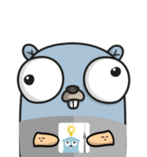

[](https://circleci.com/gh/alexfalkowski/go-health)
[](https://codecov.io/gh/alexfalkowski/go-health)
[](https://goreportcard.com/report/github.com/alexfalkowski/go-health)
[](https://pkg.go.dev/github.com/alexfalkowski/go-health/v2)
[](https://masterminds.github.io/stability/active.html)

# Health Monitoring Pattern

This repository solves the health monitoring pattern in Go.

## Background

To understand the background please have a read of [Health Endpoint Monitoring pattern](https://docs.microsoft.com/en-us/azure/architecture/patterns/health-endpoint-monitoring).

### Rationale

You might be asking yourself why create another health solution as there seems to be a few. You are right these are the ones I could find.

- [docker/go-healthcheck](https://github.com/docker/go-healthcheck)
- [InVisionApp/go-health](https://github.com/InVisionApp/go-health)
- [etherlabsio/healthcheck](https://github.com/etherlabsio/healthcheck)
- [heptiolabs/healthcheck](https://github.com/heptiolabs/healthcheck)
- [hellofresh/health-go](https://github.com/hellofresh/health-go)

So you are free to use any of these awesome solutions, though I had some requirements that I wanted met. These are as follows:

- The solution has to be asynchronous so that we don't DOS our dependencies (some of these solutions have this)
- The solution is free from other dependencies.
- Flexible enough to be able to implement any transport that is needed.
- Not to provide an opinionated way to do health monitoring across transports.

### Types

The types of monitoring that we want others to build is as follows:

- White/Black box health
- [Liveness/Readiness](https://kubernetes.io/docs/tasks/configure-pod-container/configure-liveness-readiness-startup-probes/)
- [Health Check API](https://microservices.io/patterns/observability/health-check-api.html)

## Usage

To get going please add the dependency, as follows:

```sh
go get github.com/alexfalkowski/go-health/v2
```

To use it, please look at this example:

```go
package main

import (
	"time"

	"github.com/alexfalkowski/go-health/v2/checker"
	"github.com/alexfalkowski/go-health/v2/server"
)

func main() {
	timeout := 5 * time.Second
	period := 500 * time.Millisecond

	s := server.NewServer()

	httpChecker := checker.NewHTTPChecker("https://httpstat.us/200", timeout)
	httpReg := server.NewRegistration("http", period, httpChecker)

	tcpChecker := checker.NewTCPChecker("httpstat.us:80", timeout)
	tcpReg := server.NewRegistration("tcp", period, tcpChecker)

	s.Register("myservice", httpReg, tcpReg)

	// Observe returns an error if the service isn't registered.
	// Once successful, the observer named "livez" will track these probe names.
	if err := s.Observe("myservice", "livez", httpReg.Name, tcpReg.Name); err != nil {
		panic(err)
	}

	s.Start()
	defer s.Stop()

	ob, err := s.Observer("myservice", "livez")
	if err != nil {
		panic(err)
	}

	_ = ob.Error()  // All current non-nil errors joined into one.
	_ = ob.Errors() // A copy of all current errors.
}
```
